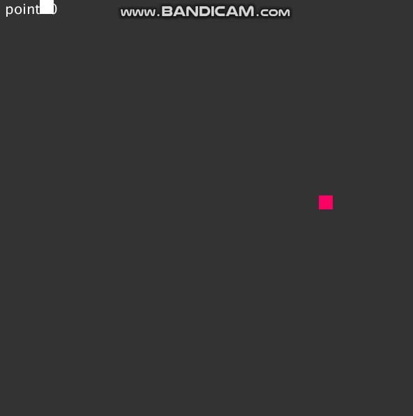

# SNAKE
SNAKE GAME by Processing 3.0

## [Project Page](https://github.com/Rascal0902/SNAKE)

<p align="center">
    
    <br>
    <sup>display snake game</sup>
    <br>
</p>

## News 
*2024/08/24: pushed project

## How to run

**Step 1**: download [processing 3.0](https://processing.org/download)

**Step 2**: clone the project
```
git clone -b main_rascal https://github.com/Rascal0902/SNAKE.git
```
**Step 3**: open file game -> game.pde

**Step 4**: play the game

You can confirm the results by checking mp4 in docs/video.mp4
